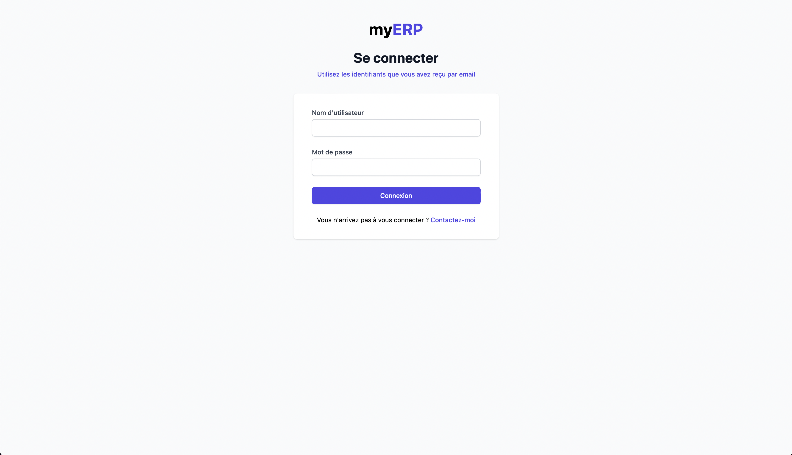
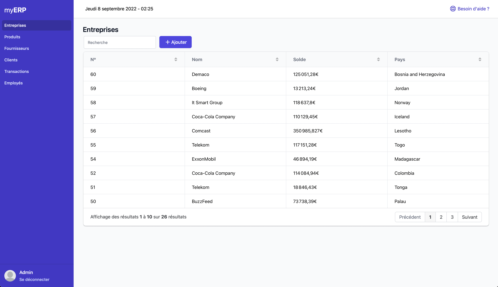
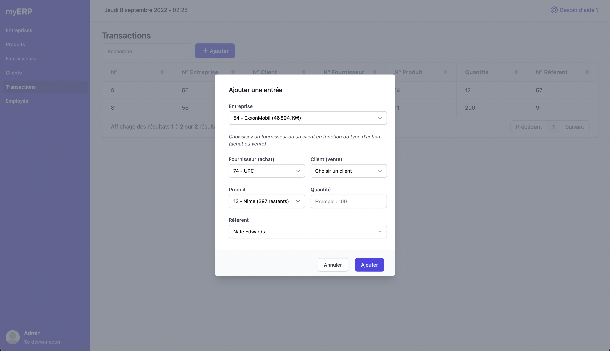
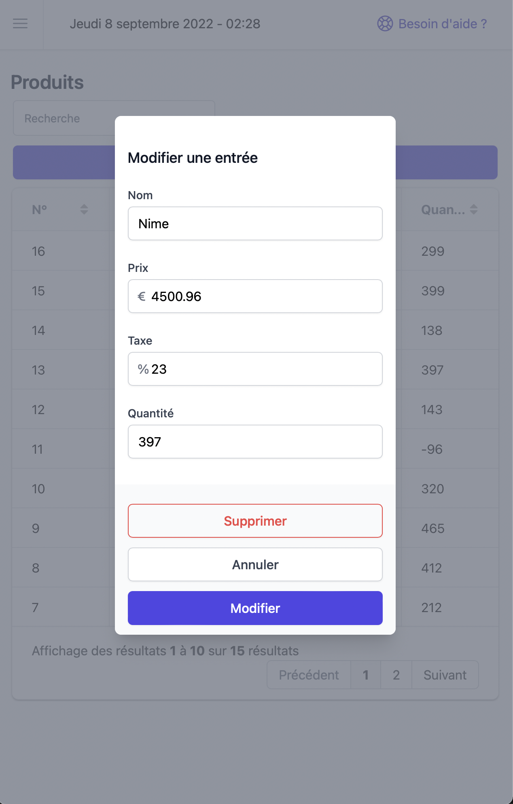
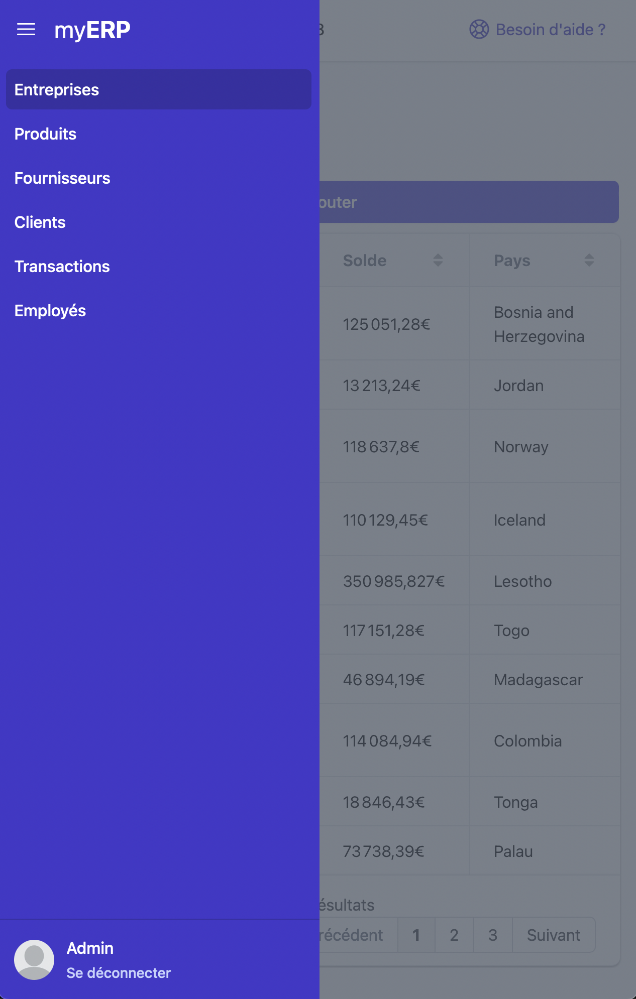

# Mini-ERP

Ce projet a pour but de concevoir et réaliser un mini ERP (Entreprise Ressource Planning). 

> Il est réalisé sous Docker, en PHP 7.4, avec Phalcon 4.0, VueJS 3, MySQL et Adminer

## Installation

###### Docker

Pour lancer le container clonez le répertoire git sur votre machine, placez vous dans le dossier avec un terminal et tapez : 
```
docker-compose up -d 
```

Ensuite installez composer 
```
$ docker exec -it php /bin/bash
$ composer install
```

Vous pouvez accéder à l'application via http://localhost

###### Base de données

La base de données est accessible via Adminer à l'url suivante : http://localhost:8080

Information de connexion : 
- Système : MySQL
- Serveur : mysql
- Utilisateur	: user
- Mot de passe : user_pw
- Base de données : app

Un export de la base de données existe dans /mysql/app.sql

###### Connexion

À l'adresse http://localhost/login il est possible de ce connecter via : 

- Utilisateur	: admin
- Mot de passe : admin
- Toutes permissions

- Utilisateur	: guest
- Mot de passe : guest
- Lecture seule


## Problèmes

Les problèmes pouvant être rencontrés lors de la mise en place de l'environnement : 
- ERROR: for db  Cannot create container for service db: status code not OK but 500: {"Message":"Unhandled exception: Filesharing has been cancelled"}
- Résolution : Dans Docker, il faut ajouter le chemin du dossier dans le partage de fichier > Réglages > Ressources > Partage de fichier  


## Test unitaires : 

Dans le container PHP en ligne de commande :
```
$ vendor/bin/phpunit
```

## Captures d'écran







